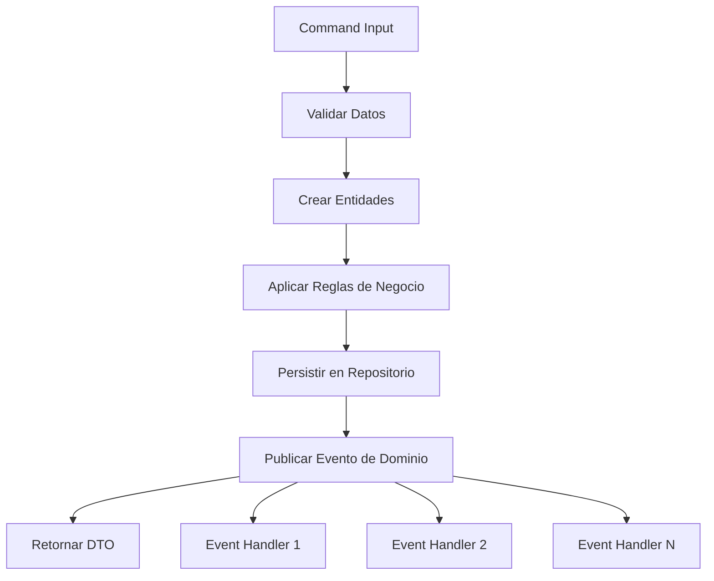

# 📚 Guía Didáctica: DDD + Event-Driven Design en Frontend Angular

## 🎯 Introducción

Esta guía te enseñará paso a paso cómo implementar **Domain-Driven Design (DDD)** con **Event-Driven Architecture** en tu frontend Angular, usando como base el arquetipo MEF que implementa Arquitectura Hexagonal.

### ¿Qué aprenderás?

- 🏗️ Implementar casos de uso completos siguiendo DDD
- 📡 Sistema de eventos de dominio con RxJS
- 🔄 Manejo de side effects con Event Handlers
- 🧪 Testear tu arquitectura paso a paso
- 🚀 Mejores prácticas en frontend enterprise

---

## 📋 Tabla de Contenidos

1. [Conceptos Fundamentales](#conceptos-fundamentales)
2. [Anatomía de un Caso de Uso](#anatomia-de-un-caso-de-uso)
3. [Tutorial: Implementar Caso de Uso Completo](#tutorial-implementar-caso-de-uso-completo)
4. [Sistema de Eventos de Dominio](#sistema-de-eventos-de-dominio)
5. [Event Handlers y Side Effects](#event-handlers-y-side-effects)
6. [Testing de la Arquitectura](#testing-de-la-arquitectura)
7. [Mejores Prácticas y Patrones](#mejores-practicas-y-patrones)

---

## 🔍 Conceptos Fundamentales

### Domain-Driven Design en Frontend

En DDD, organizamos nuestro código alrededor del **dominio del negocio**, no de la tecnología:

```typescript
// ❌ Organización técnica
/components/
/services/
/models/

// ✅ Organización por dominio  
/user/
  /entities/
  /use-cases/
  /handlers/
/product/
  /entities/
  /use-cases/
  /handlers/
```

### Event-Driven Architecture

Los **eventos de dominio** representan hechos importantes que han ocurrido:

```typescript
interface UserCreatedEvent extends DomainEvent {
  type: 'USER_CREATED';
  payload: {
    userId: string;
    email: string;
    name: string;
  };
}
```

### Arquitectura Hexagonal

Separamos nuestro código en **capas bien definidas**:

```
🎯 DOMAIN    → Entidades, Value Objects, Reglas de Negocio
🔧 APPLICATION → Casos de Uso, Puertos (Interfaces)
🔌 ADAPTERS   → Implementaciones concretas (HTTP, Storage)
🎨 UI         → Componentes Angular, Templates
```

---

## 🧬 Anatomía de un Caso de Uso

Un caso de uso en nuestro arquetipo sigue esta estructura:

### Estructura del Archivo

```typescript
// src/application/use-cases/user/create-user.use-case.ts

import { /* Entidades del dominio */ } from '@mef-frontend-arquetipo/domain';
import { /* Puertos necesarios */ } from '../../ports';
import { /* DTOs */ } from '../../dtos';

export class CreateUserUseCase {
  private logger: LoggingPort;

  constructor(
    // 🔌 Inyección de dependencias por puertos
    private userRepository: UserRepositoryPort,
    private notification: NotificationPort,
    private eventBus: EventBusPort,
    loggingPort: LoggingPort
  ) {
    this.logger = loggingPort.withContext('CreateUserUseCase');
  }

  async execute(command: CreateUserCommand): Promise<UserDto> {
    // 1. 📝 Logging y validaciones
    // 2. 🎯 Lógica de dominio
    // 3. 💾 Persistencia  
    // 4. 📡 Publicar eventos
    // 5. 🔄 Side effects
    // 6. 📤 Retornar resultado
  }
}
```

### Flujo de Ejecución



---

## 🚀 Tutorial: Implementar Caso de Uso Completo

Vamos a implementar paso a paso el caso de uso "Activar Usuario" desde cero.

### Paso 1: Definir la Entidad de Dominio

Primero, extendemos nuestra entidad User:

```typescript
// domain/src/lib/entities/user.entity.ts

export class User {
  constructor(
    private readonly id: UserId,
    private readonly email: Email,
    private readonly name: string,
    private status: UserStatus = UserStatus.PENDING, // 👈 Nuevo campo
    private readonly createdAt: Date = new Date()
  ) {}

  // 🎯 Regla de negocio: Activar usuario
  activate(): void {
    if (this.status === UserStatus.ACTIVE) {
      throw new UserAlreadyActiveError(this.id.getValue());
    }
    
    if (this.status === UserStatus.SUSPENDED) {
      throw new UserSuspendedError(this.id.getValue());
    }
    
    this.status = UserStatus.ACTIVE;
  }

  isActive(): boolean {
    return this.status === UserStatus.ACTIVE;
  }
  
  getStatus(): UserStatus {
    return this.status;
  }
}

export enum UserStatus {
  PENDING = 'PENDING',
  ACTIVE = 'ACTIVE', 
  SUSPENDED = 'SUSPENDED'
}
```

### Paso 2: Crear Value Objects y Errores

```typescript
// domain/src/lib/domain-errors/user.errors.ts

export class UserAlreadyActiveError extends Error {
  constructor(userId: string) {
    super(`User ${userId} is already active`);
    this.name = 'UserAlreadyActiveError';
  }
}

export class UserSuspendedError extends Error {
  constructor(userId: string) {
    super(`User ${userId} is suspended and cannot be activated`);
    this.name = 'UserSuspendedError';
  }
}
```

### Paso 3: Definir el Command y DTO

```typescript
// application/src/lib/dtos/commands/user.commands.ts

export interface ActivateUserCommand {
  userId: string;
  activatedBy: string; // Usuario que realiza la activación
  reason?: string;     // Razón opcional
}
```

```typescript
// application/src/lib/dtos/user.dto.ts

export interface UserDto {
  id: string;
  email: string;
  name: string;
  status: string;      // 👈 Agregamos status
  createdAt: string;
  updatedAt: string;
  isActive: boolean;
}
```

### Paso 4: Definir el Evento de Dominio

```typescript
// application/src/lib/ports/event-bus.port.ts

export interface UserActivatedEvent extends DomainEvent {
  type: 'USER_ACTIVATED';
  payload: {
    userId: string;
    email: string;
    name: string;
    activatedBy: string;
    activatedAt: Date;
    reason?: string;
  };
}
```

### Paso 5: Implementar el Caso de Uso

```typescript
// application/src/lib/use-cases/user/activate-user.use-case.ts

import { User, UserId, UserNotFoundError } from '@mef-frontend-arquetipo/domain';
import { UserRepositoryPort, LoggingPort, EventBusPort, UserActivatedEvent } from '../../ports';
import { ActivateUserCommand, UserDto } from '../../dtos';

/**
 * Caso de uso: Activar un usuario en el sistema
 * 
 * Flujo:
 * 1. Validar que el usuario existe
 * 2. Aplicar regla de negocio de activación
 * 3. Persistir cambios
 * 4. Publicar evento de dominio
 * 5. Retornar DTO actualizado
 */
export class ActivateUserUseCase {
  private logger: LoggingPort;

  constructor(
    private userRepository: UserRepositoryPort,
    private eventBus: EventBusPort,
    loggingPort: LoggingPort
  ) {
    this.logger = loggingPort.withContext('ActivateUserUseCase');
  }

  async execute(command: ActivateUserCommand): Promise<UserDto> {
    this.logger.info('Starting user activation process', {
      userId: command.userId,
      activatedBy: command.activatedBy
    });

    try {
      // 1. Validar entrada y buscar usuario
      const userId = UserId.fromString(command.userId);
      const user = await this.userRepository.findById(userId);
      
      if (!user) {
        throw new UserNotFoundError(command.userId);
      }

      this.logger.debug('User found for activation', {
        userId: command.userId,
        currentStatus: user.getStatus()
      });

      // 2. Aplicar regla de negocio
      user.activate(); // 🎯 Aquí está la lógica de dominio

      // 3. Persistir cambios
      const updatedUser = await this.userRepository.save(user);

      // 4. Publicar evento de dominio
      const userActivatedEvent: UserActivatedEvent = {
        type: 'USER_ACTIVATED',
        occurredOn: new Date(),
        aggregateId: updatedUser.getId().getValue(),
        payload: {
          userId: updatedUser.getId().getValue(),
          email: updatedUser.getEmail().getValue(),
          name: updatedUser.getName(),
          activatedBy: command.activatedBy,
          activatedAt: new Date(),
          reason: command.reason
        }
      };

      await this.eventBus.publish(userActivatedEvent);

      // 5. Convertir a DTO y retornar
      const userDto = this.mapToDto(updatedUser);

      this.logger.info('User activated successfully', {
        userId: userDto.id,
        newStatus: userDto.status
      });

      return userDto;

    } catch (error) {
      this.logger.error('Failed to activate user', error as Error, {
        command
      });
      throw error;
    }
  }

  private mapToDto(user: User): UserDto {
    return {
      id: user.getId().getValue(),
      email: user.getEmail().getValue(),
      name: user.getName(),
      status: user.getStatus(),
      createdAt: user.getCreatedAt().toISOString(),
      updatedAt: new Date().toISOString(), // En producción vendría de la entidad
      isActive: user.isActive()
    };
  }
}
```

### Paso 6: Implementar Event Handler

```typescript
// application/src/lib/handlers/user-activated.handler.ts

import { Injectable, Inject } from '@angular/core';
import { UserActivatedEvent } from '../ports/event-bus.port';
import { EventHandler } from './event-handler.interface';
import { NOTIFICATION_TOKEN, LOGGING_TOKEN } from '../tokens/injection-tokens';
import type { NotificationPort } from '../ports/notification.port';
import type { LoggingPort } from '../ports/logging.port';

@Injectable({
  providedIn: 'root'
})
export class UserActivatedHandler implements EventHandler<UserActivatedEvent> {
  readonly eventType = 'USER_ACTIVATED';

  constructor(
    @Inject(NOTIFICATION_TOKEN) private notificationService: NotificationPort,
    @Inject(LOGGING_TOKEN) private logger: LoggingPort
  ) {}

  async handle(event: UserActivatedEvent): Promise<void> {
    const { userId, email, name, activatedBy, reason } = event.payload;

    try {
      this.logger.info(`🎉 Processing USER_ACTIVATED event for: ${name}`, {
        userId,
        activatedBy,
        reason
      });

      // 1. Enviar email de confirmación de activación
      await this.sendActivationConfirmationEmail(email, name);

      // 2. Notificar al usuario que activó (si es admin)
      await this.notifyActivator(activatedBy, name, email);

      // 3. Registrar métricas de activación
      await this.recordActivationMetrics(userId, activatedBy);

      // 4. Actualizar permisos del usuario
      await this.updateUserPermissions(userId);

      this.logger.info(`✅ User activation processed successfully for ${name}`);

    } catch (error) {
      const errorObj = error instanceof Error ? error : new Error(String(error));
      this.logger.error('❌ Error processing user activation', errorObj, {
        userId,
        email
      });
      throw error;
    }
  }

  private async sendActivationConfirmationEmail(email: string, name: string): Promise<void> {
    await this.notificationService.send({
      type: 'email',
      recipient: email,
      subject: 'Tu cuenta ha sido activada',
      content: `¡Hola ${name}! Tu cuenta en el sistema MEF ha sido activada exitosamente.`,
      metadata: {
        template: 'user-activation-confirmation',
        priority: 'high'
      }
    });

    this.logger.info(`📧 Activation confirmation email sent to ${email}`);
  }

  private async notifyActivator(activatedBy: string, userName: string, userEmail: string): Promise<void> {
    // Simular notificación al admin que activó el usuario
    this.logger.info(`🔔 Notifying ${activatedBy} about activation of ${userName} (${userEmail})`);
  }

  private async recordActivationMetrics(userId: string, activatedBy: string): Promise<void> {
    // Simular registro de métricas
    await new Promise(resolve => setTimeout(resolve, 50));
    this.logger.info(`📊 Activation metrics recorded for user ${userId}`);
  }

  private async updateUserPermissions(userId: string): Promise<void> {
    // Simular actualización de permisos
    await new Promise(resolve => setTimeout(resolve, 100));
    this.logger.info(`🔐 Permissions updated for user ${userId}`);
  }
}
```

### Paso 7: Registrar el Handler

```typescript
// application/src/lib/services/event-handler-registry.service.ts

@Injectable({
  providedIn: 'root'
})
export class EventHandlerRegistryService implements OnInit {
  // ... resto del código

  ngOnInit(): void {
    this.registerHandlers();
  }

  private registerHandlers(): void {
    // Handlers existentes...
    this.eventBus.subscribe('USER_CREATED', this.userCreatedHandler.handle.bind(this.userCreatedHandler));
    this.eventBus.subscribe('PRODUCT_RESERVED', this.productReservedHandler.handle.bind(this.productReservedHandler));
    
    // 👈 Nuevo handler
    this.eventBus.subscribe('USER_ACTIVATED', this.userActivatedHandler.handle.bind(this.userActivatedHandler));
  }

  getHandlerInfo(): Array<{eventType: string, handlerName: string}> {
    return [
      { eventType: 'USER_CREATED', handlerName: 'UserCreatedHandler' },
      { eventType: 'PRODUCT_RESERVED', handlerName: 'ProductReservedHandler' },
      { eventType: 'USER_ACTIVATED', handlerName: 'UserActivatedHandler' }, // 👈 Nuevo
    ];
  }
}
```

### Paso 8: Usar en el Componente

```typescript
// host/src/app/components/user-management/user-management.component.ts

import { Component, inject } from '@angular/core';
import { ActivateUserUseCase } from '@mef-frontend-arquetipo/application';

@Component({
  selector: 'app-user-management',
  template: `
    <button 
      (click)="activateUser('user-123')"
      class="btn-primary">
      Activar Usuario
    </button>
  `
})
export class UserManagementComponent {
  private activateUserUseCase = inject(ActivateUserUseCase);

  async activateUser(userId: string): Promise<void> {
    try {
      const result = await this.activateUserUseCase.execute({
        userId,
        activatedBy: 'current-admin-id',
        reason: 'Verification completed successfully'
      });
      
      console.log('✅ User activated:', result);
    } catch (error) {
      console.error('❌ Failed to activate user:', error);
    }
  }
}
```

---

## 📡 Sistema de Eventos de Dominio

### ¿Qué son los Domain Events?

Los **Domain Events** representan hechos importantes que han ocurrido en tu dominio:

```typescript
// ✅ Buenos nombres de eventos (pasado, lo que YA ocurrió)
UserRegistered
OrderConfirmed  
PaymentProcessed
ProductReserved

// ❌ Malos nombres (presente o futuro)
RegisterUser
ConfirmOrder
ProcessPayment
```

### Anatomía de un Domain Event

```typescript
interface DomainEvent {
  readonly type: string;        // Tipo único del evento
  readonly occurredOn: Date;    // Cuándo ocurrió
  readonly aggregateId: string; // ID de la entidad afectada  
  readonly payload: any;        // Datos relevantes
}
```

### Event Bus con RxJS

Nuestro Event Bus usa **RxJS** para manejo reactivo:

```typescript
// adapters/src/lib/event-bus/rxjs-event-bus.adapter.ts

export class RxjsEventBusAdapter implements EventBusPort {
  private eventSubject = new Subject<DomainEvent>();

  // 📡 Publicar evento
  async publish<T extends DomainEvent>(event: T): Promise<void> {
    console.log(`📡 Publishing event: ${event.type}`);
    this.eventSubject.next(event);
  }

  // 👂 Suscribirse a eventos
  subscribe<T extends DomainEvent>(
    eventType: string,
    handler: (event: T) => Promise<void>
  ): () => void {
    const subscription = this.eventSubject.pipe(
      filter(event => event.type === eventType)
    ).subscribe(async (event) => {
      await handler(event as T);
    });

    return () => subscription.unsubscribe();
  }
}
```

### Mejores Prácticas de Eventos

```typescript
// ✅ Evento bien estructurado
interface UserProfileUpdatedEvent extends DomainEvent {
  type: 'USER_PROFILE_UPDATED';
  payload: {
    userId: string;
    oldProfile: UserProfile;
    newProfile: UserProfile; 
    updatedBy: string;
    fields: string[]; // Qué campos cambiaron
  };
}

// ✅ Uso en caso de uso
export class UpdateUserProfileUseCase {
  async execute(command: UpdateProfileCommand): Promise<UserDto> {
    const oldProfile = user.getProfile();
    user.updateProfile(newProfile);
    
    await this.repository.save(user);
    
    // Publicar evento con información útil
    await this.eventBus.publish({
      type: 'USER_PROFILE_UPDATED',
      aggregateId: user.getId().getValue(),
      occurredOn: new Date(),
      payload: {
        userId: user.getId().getValue(),
        oldProfile,
        newProfile,
        updatedBy: command.updatedBy,
        fields: this.getChangedFields(oldProfile, newProfile)
      }
    });
  }
}
```

---

## 🔄 Event Handlers y Side Effects

Los **Event Handlers** se encargan de los efectos secundarios que deben ocurrir cuando un evento es publicado.

### Principios de los Event Handlers

1. **Idempotentes**: Ejecutar el mismo handler varias veces debe producir el mismo resultado
2. **Resilientes**: Deben manejar errores gracefully
3. **Asíncronos**: No bloquean el flujo principal
4. **Independientes**: Un handler no debe depender de otro

### Implementación de Handler Robusto

```typescript
@Injectable({
  providedIn: 'root'
})
export class UserCreatedHandler implements EventHandler<UserCreatedEvent> {
  readonly eventType = 'USER_CREATED';

  constructor(
    @Inject(NOTIFICATION_TOKEN) private notification: NotificationPort,
    @Inject(LOGGING_TOKEN) private logger: LoggingPort
  ) {}

  async handle(event: UserCreatedEvent): Promise<void> {
    const handlerContext = `${this.eventType}-${event.aggregateId}`;
    
    try {
      this.logger.info('🎬 Starting event processing', {
        eventType: event.type,
        aggregateId: event.aggregateId,
        context: handlerContext
      });

      // ✅ Procesar en paralelo cuando sea posible
      await Promise.allSettled([
        this.sendWelcomeEmail(event),
        this.createDefaultProfile(event),
        this.recordUserMetrics(event)
      ]);

      // ✅ Acciones que requieren orden secuencial
      await this.notifyAdministrators(event);
      
      this.logger.info('✅ Event processed successfully', { context: handlerContext });

    } catch (error) {
      // ✅ Error handling robusto
      await this.handleError(error as Error, event, handlerContext);
      throw error; // Re-throw para permitir retry en capas superiores
    }
  }

  private async sendWelcomeEmail(event: UserCreatedEvent): Promise<void> {
    try {
      await this.notification.send({
        type: 'email',
        recipient: event.payload.email,
        subject: '¡Bienvenido!',
        content: `Hola ${event.payload.name}, bienvenido al sistema.`
      });
      
      this.logger.info('📧 Welcome email sent successfully');
    } catch (error) {
      // ✅ Log específico por acción
      this.logger.error('Failed to send welcome email', error as Error, {
        email: event.payload.email
      });
      // ✅ En este caso, no re-throw porque el email no es crítico
    }
  }

  private async handleError(error: Error, event: UserCreatedEvent, context: string): Promise<void> {
    this.logger.error('❌ Event handler failed', error, {
      context,
      eventType: event.type,
      aggregateId: event.aggregateId
    });

    // ✅ Posibles acciones de recuperación:
    // - Enviar a dead letter queue
    // - Notificar sistema de monitoreo  
    // - Intentar compensación si es posible
  }
}
```

### Registro Automático de Handlers

```typescript
// application/src/lib/services/event-handler-registry.service.ts

@Injectable({
  providedIn: 'root'
})
export class EventHandlerRegistryService implements OnInit {
  private handlers: EventHandler<any>[] = [];
  private unsubscribeCallbacks: (() => void)[] = [];

  constructor(
    @Inject(EVENT_BUS_TOKEN) private eventBus: EventBusPort,
    // 👇 Inyectar todos los handlers disponibles
    private userCreatedHandler: UserCreatedHandler,
    private userActivatedHandler: UserActivatedHandler,
    private productReservedHandler: ProductReservedHandler
  ) {
    this.handlers = [
      this.userCreatedHandler,
      this.userActivatedHandler,
      this.productReservedHandler
    ];
  }

  ngOnInit(): void {
    this.registerAllHandlers();
  }

  private registerAllHandlers(): void {
    this.handlers.forEach(handler => {
      const unsubscribe = this.eventBus.subscribe(
        handler.eventType,
        handler.handle.bind(handler)
      );
      
      this.unsubscribeCallbacks.push(unsubscribe);
      
      console.log(`✅ Registered handler for ${handler.eventType}`);
    });
  }

  ngOnDestroy(): void {
    this.unsubscribeCallbacks.forEach(unsubscribe => unsubscribe());
  }
}
```

---

## 🧪 Testing de la Arquitectura

### Testing de Entidades de Dominio

```typescript
// domain/src/lib/entities/user.entity.spec.ts

describe('User Entity', () => {
  let user: User;
  let userId: UserId;
  let email: Email;

  beforeEach(() => {
    userId = UserId.generate();
    email = Email.fromString('test@mef.gob.pe');
    user = new User(userId, email, 'Test User');
  });

  describe('activate()', () => {
    it('should activate a pending user', () => {
      // Act
      user.activate();

      // Assert
      expect(user.isActive()).toBe(true);
      expect(user.getStatus()).toBe(UserStatus.ACTIVE);
    });

    it('should throw error when activating already active user', () => {
      // Arrange
      user.activate(); // First activation

      // Act & Assert
      expect(() => user.activate()).toThrow(UserAlreadyActiveError);
    });

    it('should throw error when activating suspended user', () => {
      // Arrange
      user.suspend(); // Suspend user first

      // Act & Assert  
      expect(() => user.activate()).toThrow(UserSuspendedError);
    });
  });
});
```

### Testing de Casos de Uso

```typescript
// application/src/lib/use-cases/user/activate-user.use-case.spec.ts

describe('ActivateUserUseCase', () => {
  let useCase: ActivateUserUseCase;
  let mockUserRepository: jest.Mocked<UserRepositoryPort>;
  let mockEventBus: jest.Mocked<EventBusPort>;
  let mockLogger: jest.Mocked<LoggingPort>;

  beforeEach(() => {
    // 🎭 Mock setup
    mockUserRepository = {
      findById: jest.fn(),
      save: jest.fn(),
      findByEmail: jest.fn()
    };

    mockEventBus = {
      publish: jest.fn(),
      subscribe: jest.fn(),
      publishBatch: jest.fn()
    };

    mockLogger = {
      info: jest.fn(),
      debug: jest.fn(),
      error: jest.fn(),
      withContext: jest.fn().mockReturnThis()
    };

    useCase = new ActivateUserUseCase(
      mockUserRepository,
      mockEventBus,
      mockLogger
    );
  });

  describe('execute()', () => {
    it('should activate user successfully and publish event', async () => {
      // Arrange
      const userId = UserId.generate();
      const email = Email.fromString('test@mef.gob.pe');
      const user = new User(userId, email, 'Test User', UserStatus.PENDING);
      
      const command: ActivateUserCommand = {
        userId: userId.getValue(),
        activatedBy: 'admin-123',
        reason: 'Verification completed'
      };

      mockUserRepository.findById.mockResolvedValue(user);
      mockUserRepository.save.mockResolvedValue(user);

      // Act
      const result = await useCase.execute(command);

      // Assert
      expect(mockUserRepository.findById).toHaveBeenCalledWith(userId);
      expect(mockUserRepository.save).toHaveBeenCalledWith(user);
      expect(mockEventBus.publish).toHaveBeenCalledWith(
        expect.objectContaining({
          type: 'USER_ACTIVATED',
          aggregateId: userId.getValue(),
          payload: expect.objectContaining({
            userId: userId.getValue(),
            activatedBy: 'admin-123'
          })
        })
      );
      expect(result.isActive).toBe(true);
    });

    it('should throw UserNotFoundError when user does not exist', async () => {
      // Arrange
      const command: ActivateUserCommand = {
        userId: 'non-existent-id',
        activatedBy: 'admin-123'
      };

      mockUserRepository.findById.mockResolvedValue(null);

      // Act & Assert
      await expect(useCase.execute(command))
        .rejects.toThrow(UserNotFoundError);
        
      expect(mockEventBus.publish).not.toHaveBeenCalled();
    });
  });
});
```

### Testing de Event Handlers

```typescript
// application/src/lib/handlers/user-activated.handler.spec.ts

describe('UserActivatedHandler', () => {
  let handler: UserActivatedHandler;
  let mockNotification: jest.Mocked<NotificationPort>;
  let mockLogger: jest.Mocked<LoggingPort>;

  beforeEach(() => {
    mockNotification = {
      send: jest.fn(),
      sendWelcomeEmail: jest.fn()
    };

    mockLogger = {
      info: jest.fn(),
      error: jest.fn(),
      debug: jest.fn()
    };

    handler = new UserActivatedHandler(mockNotification, mockLogger);
  });

  it('should process user activation event successfully', async () => {
    // Arrange
    const event: UserActivatedEvent = {
      type: 'USER_ACTIVATED',
      aggregateId: 'user-123',
      occurredOn: new Date(),
      payload: {
        userId: 'user-123',
        email: 'test@mef.gob.pe',
        name: 'Test User',
        activatedBy: 'admin-456',
        activatedAt: new Date()
      }
    };

    mockNotification.send.mockResolvedValue(void 0);

    // Act
    await handler.handle(event);

    // Assert
    expect(mockNotification.send).toHaveBeenCalledWith(
      expect.objectContaining({
        type: 'email',
        recipient: 'test@mef.gob.pe',
        subject: 'Tu cuenta ha sido activada'
      })
    );
    expect(mockLogger.info).toHaveBeenCalledWith(
      expect.stringContaining('User activation processed successfully')
    );
  });

  it('should handle notification failures gracefully', async () => {
    // Arrange
    const event: UserActivatedEvent = {
      type: 'USER_ACTIVATED',
      aggregateId: 'user-123',
      occurredOn: new Date(),
      payload: {
        userId: 'user-123',
        email: 'test@mef.gob.pe',
        name: 'Test User',
        activatedBy: 'admin-456',
        activatedAt: new Date()
      }
    };

    const notificationError = new Error('SMTP server unavailable');
    mockNotification.send.mockRejectedValue(notificationError);

    // Act & Assert
    await expect(handler.handle(event)).rejects.toThrow(notificationError);
    expect(mockLogger.error).toHaveBeenCalledWith(
      '❌ Error processing user activation',
      notificationError,
      expect.any(Object)
    );
  });
});
```

### Testing de Integración

```typescript
// e2e/user-activation.e2e.spec.ts

describe('User Activation E2E', () => {
  let app: INestApplication;
  let eventBus: EventBusPort;
  let userRepository: UserRepositoryPort;

  beforeEach(async () => {
    const module = await Test.createTestingModule({
      // ... module setup
    }).compile();

    app = module.createNestApplication();
    eventBus = module.get(EVENT_BUS_TOKEN);
    userRepository = module.get(USER_REPOSITORY_TOKEN);
    
    await app.init();
  });

  it('should complete user activation flow end-to-end', async () => {
    // Arrange
    const userId = UserId.generate();
    const email = Email.fromString('integration@mef.gob.pe');
    const user = new User(userId, email, 'Integration Test User');
    await userRepository.save(user);

    const eventSpy = jest.fn();
    eventBus.subscribe('USER_ACTIVATED', eventSpy);

    // Act
    const response = await request(app.getHttpServer())
      .post(`/users/${userId.getValue()}/activate`)
      .send({
        activatedBy: 'admin-test',
        reason: 'Integration test activation'
      });

    // Assert
    expect(response.status).toBe(200);
    expect(response.body.isActive).toBe(true);
    
    // Verificar que el evento fue publicado
    await new Promise(resolve => setTimeout(resolve, 100)); // Wait for async events
    expect(eventSpy).toHaveBeenCalledWith(
      expect.objectContaining({
        type: 'USER_ACTIVATED',
        aggregateId: userId.getValue()
      })
    );
  });
});
```

---

## 🎯 Mejores Prácticas y Patrones

### 1. Naming Conventions

```typescript
// ✅ Nombres claros y consistentes

// Entidades: PascalCase, sustantivos
class User { }
class Product { }

// Value Objects: Sufijo 'VO' o nombre descriptivo
class Email { }
class Money { }
class UserId { }

// Casos de uso: Verbo + Entidad + UseCase
class CreateUserUseCase { }
class ActivateUserUseCase { }
class GetUserByIdUseCase { }

// Eventos: Entidad + Pasado + Event
interface UserCreatedEvent { }
interface ProductReservedEvent { }

// Handlers: Evento sin 'Event' + Handler
class UserCreatedHandler { }
class ProductReservedHandler { }

// Errores: Descripción + Error
class UserNotFoundError { }
class ProductNotAvailableError { }
```

### 2. Inyección de Dependencias

```typescript
// ✅ Usando tokens para abstraer dependencias
export const USER_REPOSITORY_TOKEN = new InjectionToken<UserRepositoryPort>('UserRepositoryPort');
export const EVENT_BUS_TOKEN = new InjectionToken<EventBusPort>('EventBusPort');

// En el constructor
constructor(
  @Inject(USER_REPOSITORY_TOKEN) private userRepository: UserRepositoryPort,
  @Inject(EVENT_BUS_TOKEN) private eventBus: EventBusPort
) {}
```

### 3. Error Handling Estratégico

```typescript
// ✅ Jerarquía de errores clara
abstract class DomainError extends Error {
  abstract readonly code: string;
  abstract readonly context: Record<string, any>;
}

class UserNotFoundError extends DomainError {
  readonly code = 'USER_NOT_FOUND';
  readonly context: { userId: string };

  constructor(userId: string) {
    super(`User with ID ${userId} not found`);
    this.context = { userId };
  }
}

// En casos de uso
async execute(command: ActivateUserCommand): Promise<UserDto> {
  try {
    // ... lógica
  } catch (error) {
    if (error instanceof DomainError) {
      this.logger.error(`Domain error: ${error.code}`, error, error.context);
    } else {
      this.logger.error('Unexpected error', error as Error, { command });
    }
    throw error;
  }
}
```

### 4. Logging Estructurado

```typescript
// ✅ Logging con contexto rico
this.logger.info('User activation started', {
  userId: command.userId,
  activatedBy: command.activatedBy,
  timestamp: new Date().toISOString(),
  correlationId: generateCorrelationId()
});

// ✅ Logger con contexto
private logger: LoggingPort = this.loggingPort.withContext('ActivateUserUseCase');
```

### 5. Composition Root

```typescript
// app/app.config.ts - Configurar todas las dependencias

export const appConfig: ApplicationConfig = {
  providers: [
    // Adapters
    { provide: USER_REPOSITORY_TOKEN, useClass: HttpUserRepository },
    { provide: EVENT_BUS_TOKEN, useClass: RxjsEventBusAdapter },
    { provide: LOGGING_TOKEN, useClass: ConsoleLoggingAdapter },
    
    // Use Cases  
    ActivateUserUseCase,
    CreateUserUseCase,
    
    // Handlers
    UserCreatedHandler,
    UserActivatedHandler,
    
    // Services
    EventHandlerRegistryService,
    
    // ... otros providers
  ]
};
```

### 6. Testing Helpers

```typescript
// test/helpers/test-factories.ts

export class TestUserFactory {
  static createPendingUser(overrides?: Partial<UserData>): User {
    const defaults = {
      id: UserId.generate(),
      email: Email.fromString('test@mef.gob.pe'),
      name: 'Test User',
      status: UserStatus.PENDING
    };
    
    const userData = { ...defaults, ...overrides };
    return new User(userData.id, userData.email, userData.name, userData.status);
  }

  static createActivatedUser(): User {
    const user = this.createPendingUser();
    user.activate();
    return user;
  }
}

export class TestEventFactory {
  static createUserActivatedEvent(overrides?: Partial<UserActivatedEvent>): UserActivatedEvent {
    return {
      type: 'USER_ACTIVATED',
      aggregateId: 'test-user-id',
      occurredOn: new Date(),
      payload: {
        userId: 'test-user-id',
        email: 'test@mef.gob.pe',
        name: 'Test User',
        activatedBy: 'admin-test',
        activatedAt: new Date()
      },
      ...overrides
    };
  }
}
```

### 7. Monitoreo y Observabilidad

```typescript
// shared/src/lib/monitoring/metrics.service.ts

@Injectable()
export class MetricsService {
  private metrics = new Map<string, number>();

  incrementCounter(name: string, tags?: Record<string, string>): void {
    const key = this.buildKey(name, tags);
    this.metrics.set(key, (this.metrics.get(key) || 0) + 1);
  }

  recordHistogram(name: string, value: number, tags?: Record<string, string>): void {
    // Implementación de histograma
  }

  private buildKey(name: string, tags?: Record<string, string>): string {
    if (!tags) return name;
    const tagString = Object.entries(tags)
      .map(([key, value]) => `${key}=${value}`)
      .join(',');
    return `${name}|${tagString}`;
  }
}

// En casos de uso
async execute(command: ActivateUserCommand): Promise<UserDto> {
  const startTime = Date.now();
  
  try {
    const result = await this.doExecute(command);
    
    this.metrics.incrementCounter('use_case_success', {
      useCase: 'ActivateUser'
    });
    
    return result;
  } catch (error) {
    this.metrics.incrementCounter('use_case_error', {
      useCase: 'ActivateUser',
      errorType: error.constructor.name
    });
    throw error;
  } finally {
    this.metrics.recordHistogram('use_case_duration', Date.now() - startTime, {
      useCase: 'ActivateUser'
    });
  }
}
```

---

## 🎓 Conclusión

Has aprendido a implementar **Domain-Driven Design** con **Event-Driven Architecture** en Angular:

### ✅ Lo que dominas ahora:

1. **Arquitectura Hexagonal** con separación clara de responsabilidades
2. **Casos de uso robustos** con manejo de errores y logging
3. **Sistema de eventos** reactivo con RxJS
4. **Event handlers** para side effects
5. **Testing completo** de toda la arquitectura
6. **Mejores prácticas** para código enterprise

### 🚀 Próximos pasos:

1. **Implementa más casos de uso** siguiendo estos patrones
2. **Agrega más eventos** para casos complejos
3. **Mejora el testing** con más casos edge
4. **Implementa métricas** y monitoreo avanzado
5. **Considera CQRS** para separar lecturas de escrituras

### 📚 Recursos adicionales:

- [Domain-Driven Design de Eric Evans](https://www.domainlanguage.com/ddd/)
- [Clean Architecture de Robert Martin](https://blog.cleancoder.com/uncle-bob/2012/08/13/the-clean-architecture.html)
- [Event Storming](https://www.eventstorming.com/)

¡Felicitaciones! 🎉 Ahora tienes las herramientas para construir aplicaciones frontend robustas, mantenibles y escalables usando los mejores patrones de la industria.